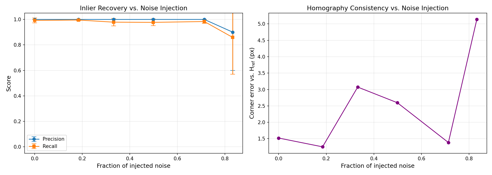
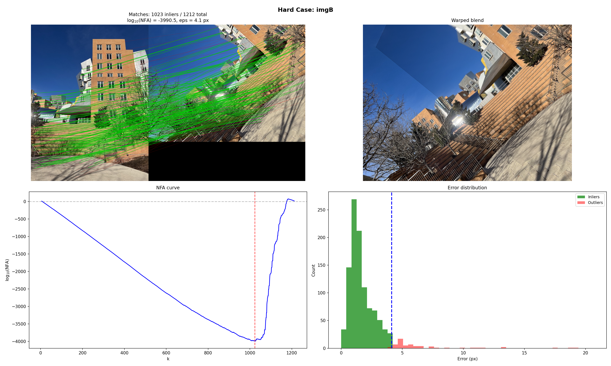
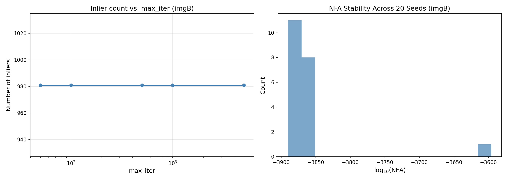

# ORSA Homography Registration

A Python implementation of the **ORSA** (Optimized Random Sampling) algorithm for automatic homographic registration of image pairs, based on the **a-contrario** framework.

Unlike classical RANSAC, which requires a manually tuned inlier threshold, ORSA adaptively selects the threshold that minimizes the **Number of False Alarms (NFA)**, providing rigorous statistical control on false detections. A detection is declared meaningful when NFA < 1, meaning the observed geometric agreement would be expected to occur less than once in purely random data.

> **Reference:** L. Moisan, P. Moulon, and P. Monasse, *"Automatic Homographic Registration of a Pair of Images, with A Contrario Elimination of Outliers,"* Image Processing On Line (IPOL), 2012.

## Theoretical Background

When two images share a planar scene or a pure camera rotation, their geometric relationship is described by a **projective homography**. While four correct point correspondences suffice to estimate it, feature matchers like SIFT typically produce many outliers that corrupt direct estimation.

The **a-contrario approach** draws from the Helmholtz principle: a structure is perceptually meaningful if it is very unlikely to arise by chance. ORSA defines a null model of random, unstructured correspondences and asks *how surprising would the observed agreement be under this model?* The NFA quantifies this surprise:

```
log10 NFA(k, epsilon) = log10 C(n,k) + log10 C(k,4) + (k-4) * log10(alpha)
```

where `alpha = pi * epsilon^2 / (w * h)` is the probability that a random point falls within distance `epsilon` of the predicted position, `n` is the total number of correspondences, and `k` is the number of inliers.

## Algorithm Overview

1. **Random sampling** -- Draw minimal 4-point samples and estimate homographies via DLT with Hartley normalization.
2. **Adaptive threshold** -- For each candidate, test all possible inlier counts *k* and select the threshold that minimizes NFA(*k*, *epsilon*).
3. **NFA criterion** -- Computed entirely in log-space using precomputed binomial coefficient tables for numerical stability.
4. **Degeneracy checks** -- Collinearity detection, conditioning (cond <= 10 on normalized H), orientation preservation, and valid warp verification prevent degenerate solutions.
5. **Adaptive iterations** -- Iteration count adjusts based on the current estimated inlier ratio, often terminating early when inliers are abundant.
6. **Refinement** -- Iterative DLT refit on inliers until NFA convergence, followed by Levenberg-Marquardt polishing.

Per-iteration cost is **O(n log n)** (dominated by residual sorting), giving **O(Tn log n)** total for *T* iterations.

## Experimental Results

All quantitative experiments use real SIFT matches from real image pairs.

### Null model validation

Running ORSA on shuffled real keypoints (where all correspondences are broken) produces **zero false alarms across 250 trials** (50 trials x 5 subsample sizes). The smallest observed log10 NFA is +3.7, more than three orders of magnitude above the detection threshold.


### Robustness to outlier injection

Starting from 1106 real SIFT matches, random false correspondences are progressively injected:

| Injected noise | 0% | 18% | 33% | 50% | 71% | 83% |
|---|---|---|---|---|---|---|
| Detection rate | 10/10 | 10/10 | 10/10 | 10/10 | 10/10 | 9/10 |
| Precision | 1.00 | 1.00 | 1.00 | 1.00 | 1.00 | 0.90 |
| Recall | 0.99 | 1.00 | 0.98 | 0.98 | 0.98 | 0.86 |

ORSA maintains perfect precision and near-perfect recall up to 71% noise.



### Real image pairs

| Case | Matches | Inliers | log10 NFA | Threshold |
|---|---|---|---|---|
| Easy (imgA) | 1254 | 564 (45%) | -1645 | 30.3 px |
| Hard (imgB) | 1212 | 1023 (84%) | -3991 | 4.1 px |




### Sensitivity analysis

The algorithm is stable across iteration budgets (50-5000 all yield identical results) and random seeds (inlier count std = 11 over 20 trials).



## Project Structure

```
src/
  orsa.py            # Main ORSA algorithm (adaptive RANSAC loop)
  nfa.py             # A-contrario NFA computation in log-space
  homography.py      # DLT estimation, symmetric transfer error, LM refinement
  degeneracy.py      # Geometric validation (collinearity, conditioning, warp checks)
  matching.py        # Feature detection and matching (SIFT, ORB)
  visualization.py   # Plotting utilities (matches, NFA curves, error histograms)

experiments/
  run_experiments.py  # Experiment runner (6 experiment types)
  synthetic.py        # Synthetic data generation with ground truth
  data/               # Test images
  results/            # Output JSON and figures

tests/                # Unit tests covering all modules
  test_orsa.py
  test_nfa.py
  test_homography.py
  test_degeneracy.py

report/               # LaTeX report with full derivations and analysis
```

## Setup

```bash
pip install -r requirements.txt
```

Requires Python >= 3.10.

## Usage

```python
import cv2
from src.orsa import orsa_homography
from src.matching import detect_and_match

img1 = cv2.imread("image1.jpg")
img2 = cv2.imread("image2.jpg")

# Detect and match features
match_result = detect_and_match(img1, img2, method="sift", ratio_thresh=0.75)

# Run ORSA
result = orsa_homography(
    match_result.pts1,
    match_result.pts2,
    img1.shape[:2],
    img2.shape[:2],
    max_iter=1000,
    seed=42,
)

if result.log_nfa < 0:
    print(f"Homography detected (NFA = 10^{result.log_nfa:.2f})")
    print(f"Inliers: {result.n_inliers}/{result.n_matches}")
    print(f"Homography:\n{result.H}")
else:
    print("No meaningful homography found")
```

## Experiments

Six experiments are available:

| Experiment | Description |
|---|---|
| `null_model` | Validates rejection of random matches (NFA > 1) |
| `outlier_injection` | Robustness to increasing fractions of random noise |
| `real_easy` | Easy image pairs with clear homographies |
| `real_hard` | Challenging cases with large viewpoint changes |
| `failure` | Cases where no valid homography exists (shuffled matches, multiple homographies, extreme outliers) |
| `sensitivity` | Iteration budget and seed stability analysis |

```bash
# Run all experiments
python -m experiments.run_experiments

# Run a specific experiment
python -m experiments.run_experiments --experiment outlier_injection

# Custom output directory
python -m experiments.run_experiments --output-dir my_results/
```

Results are saved as JSON files and PNG figures in `experiments/results/`.

## Tests

```bash
# Run all tests
python -m pytest tests/ -v

# Run a specific module
python -m pytest tests/test_orsa.py -v
```

## Known Limitations

- **Extreme outlier ratios (>90%):** The probability of drawing a clean 4-point sample becomes vanishingly small, causing detection failure.
- **Single homography model:** Only one homography is detected per run. Scenes with multiple planes require iterative application with inlier removal.
- **Very few inliers:** The combinatorial NFA correction penalizes small inlier counts heavily, requiring strong statistical evidence for detection.

## References

- L. Moisan, P. Moulon, P. Monasse. *Automatic Homographic Registration of a Pair of Images, with A Contrario Elimination of Outliers.* IPOL, 2012.
- A. Desolneux, L. Moisan, J.-M. Morel. *From Gestalt Theory to Image Analysis: A Probabilistic Approach.* Springer, 2008.
- M. A. Fischler, R. C. Bolles. *Random Sample Consensus.* Communications of the ACM, 1981.
- R. Hartley, A. Zisserman. *Multiple View Geometry in Computer Vision.* Cambridge University Press, 2003.
